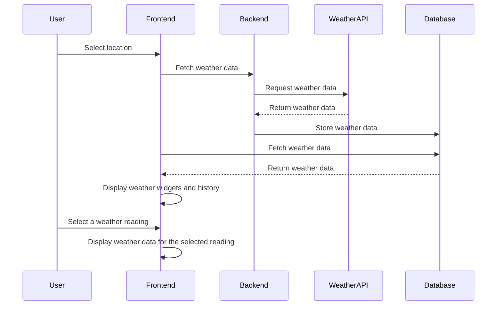

# Weather Widget App Challenge

This is a full-stack app challenge to build a weather widget that displays weather 
information from weatherapi.com. The backend is built with ExpressJS and the frontend is 
built with ReactJS. The project consists of three containers: postgres-db, tgx-backend, 
and tgx-frontend, which can be run with Docker Compose.

## Getting Started

To start the project, run the following command:

```bash
docker compose --env-file=./envs/base.env up
```

If you are using Windows, please modify the path accordingly.

The backend is exposed on port 9000 for REST APIs, and the frontend is exposed on port 3000.

## Backend

The backend is responsible for fetching weather information from weatherapi.com and 
storing it in the database. It uses latitude and longitude provided by the user to 
fetch weather information. The backend should fetch the weather information every 
10 minutes and store it in the database. The database design is up to the challenger.

## Frontend

The frontend consists of two weather widgets, one horizontal and one vertical. 
The widgets should display the latest weather information stored in the database. 
In addition to the weather widgets, the frontend should also display a history of 
weather readings. When a user selects a reading from the history, 
the corresponding weather information should be displayed in the widgets.


## Sequence Diagram

The following is a sequence diagram for the app:




## Conclusion

This is a challenging full-stack app that requires the challenger to use their knowledge 
of ExpressJS, ReactJS, and database design to create a functional and visually 
appealing weather widget. The challenge can be modified as needed to meet specific requirements. 
The challenger's documentation, code style, and testing will be evaluated as part of the 
challenge.
